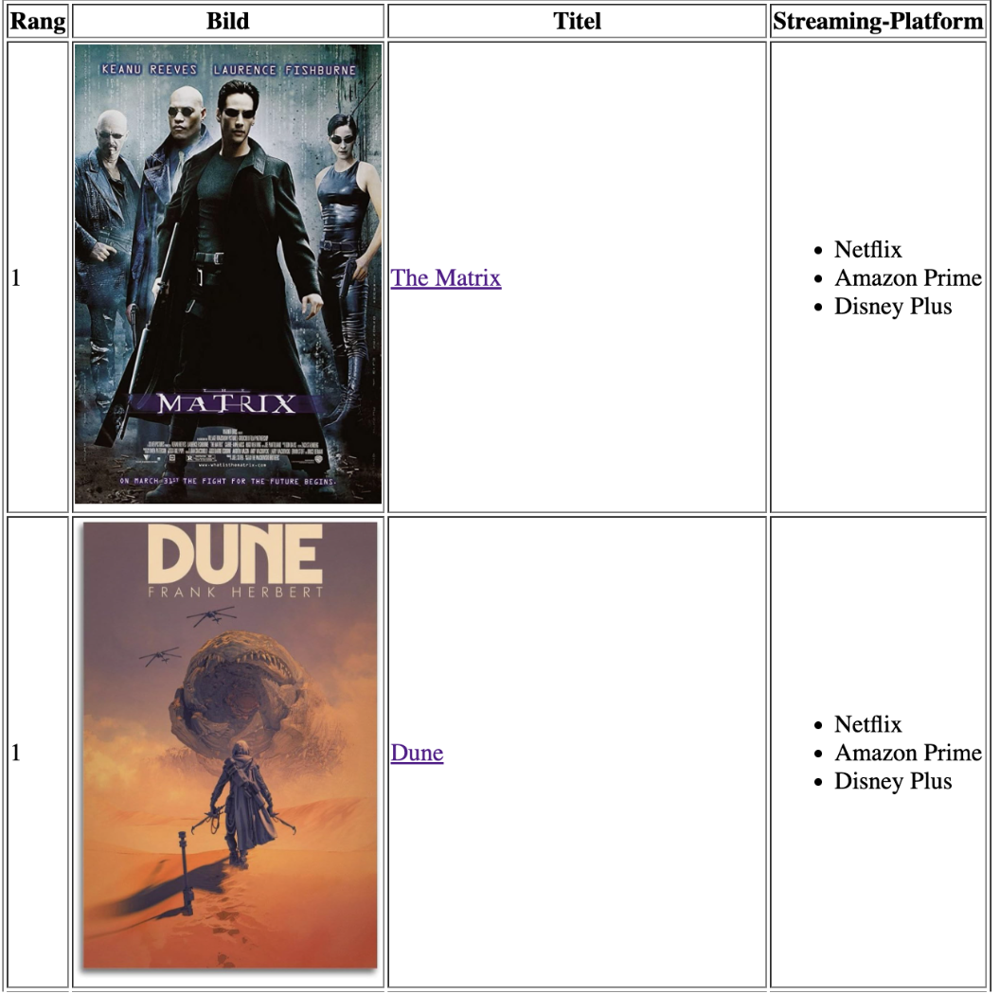

# Aufgaben 

## HTML und CSS Aufgaben

### Übung 1: Grundaufbau

- Erstellen Sie eine Webseite mit den Grundelementen (`<html>`, `<head>`, `<title>`, `<body>`).
- Fügen Sie folgende Elemente ein:
    - **Überschrift**
    - **Paragraph**
    - **Ein Bild**
    - **Paragraph mit anderer Schriftart**

### Übung 2: Top 3 Filmliste

- Erstellen Sie eine Top 3 Filmliste:
    - Rang, Titel, Bild und Streamingplattformen
    - Übersichtlich gestalten → Tabelle verwenden
    - Überschriften sollen sich vom Rest abheben → `<th>`
    - Streaming Plattform Liste sollte eine ungeordnete Liste sein
    - Verlinkung des Filmnamens mit der dazugehörigen Wikipedia-Seite
    - Beispiel: 

### Übung 3: Kontaktformular

- Kontaktformular erstellen:
    - Namensfeld → Required
    - Email Adressfeld → Required
    - Textarea für eine Nachricht
    - Submit und Reset Button

## JavaScript Aufgaben
### Übung 4: Zufällige Bewertung

- Schreibe eine Funktion, die einen Namen (String) als Parameter akzeptiert und eine zufällige Zahl zwischen 0 und 10 generiert. Je nachdem, ob diese Zahl gerade oder ungerade ist, soll die Funktion den Namen mit dem String " ist ein Depp." oder " ist ein Genie." verkettet und zurückgeben.
- Führe diese Funktion mehrfach hintereinander mit verschiedenen Namen als Argument aus.

### Tipp für Übung 4: Zufällige Bewertung

- Zufallszahl zwischen 0 und 10 generieren: `Math.floor(Math.random() * 11);`
- Modulo-Operator für die Ermittlung von gerade/ungerade nutzen
- Beispiel:
    ```javascript
    function zufälligeBewertung(name) {
        const zahl = Math.floor(Math.random() * 11);
        if (zahl % 2 === 0) {
            return name + " ist ein Genie.";
        } else {
            return name + " ist ein Depp.";
        }
    }
    ```


## Vue.js Aufgaben